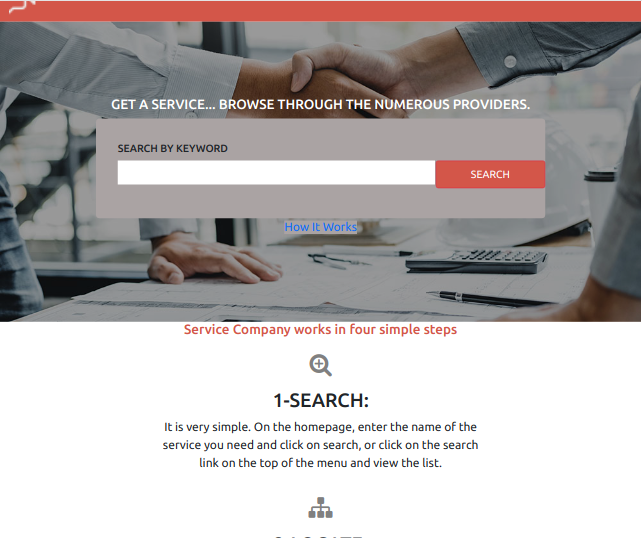
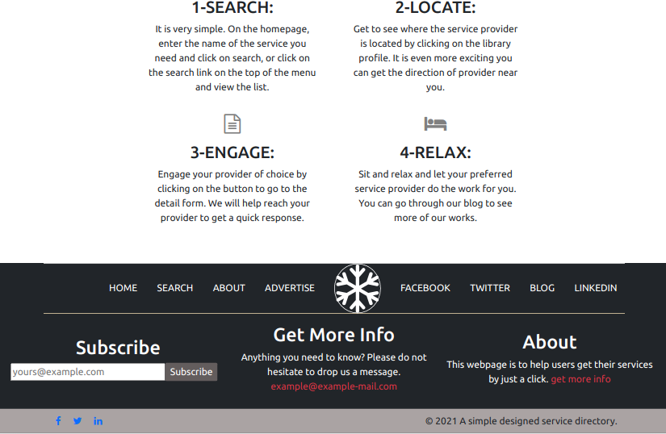

# Capstone Project: Building a School Directory 
This project is for learning purposes at Microverse. It is a School Directory (PATA SHULE) replica to test on the mastery of the HTML/CSS Module.

>

This project is a HTML/CSS capstone-1 project. The project is meant to test the mastery of the module 1, by building a similar page to PATASHULE Directory.

## Built With

- HTML
- Bootstrap
- CSS
- Font-Awesome
- Git Workflows

## Live Demo

[Live Demo Link](https://aduda-boaz.github.io/capstone-1/)

## Getting Started

**This is an example of how you may give instructions on setting up your project locally.**
**Modify this file to match your project, remove sections that don't apply. For example: delete the testing section if the currect project doesn't require testing.**

To get a local copy up and running follow these simple example steps.

## Authors

👤 **Author1**

- GitHub: [@Aduda-Boaz](https://github.com/Aduda-Boaz)
- Twitter: [@BoazAduda](https://twitter.com/BoazAduda)
- LinkedIn: [LinkedIn](https://linkedin.com/linkedinhandle)

## 🤝 Contributing

Contributions, issues, and feature requests are welcome!

Feel free to check the [issues page](issues/).

## Show your support

Give a ⭐️ if you like this project!

## Acknowledgments

- Special thanks to [PATASHULE](https://www.behance.net/gallery/25563385/PatashuleKE)
  for the design inspiration

## 📝 License

This project is [MIT](lic.url) licensed.
